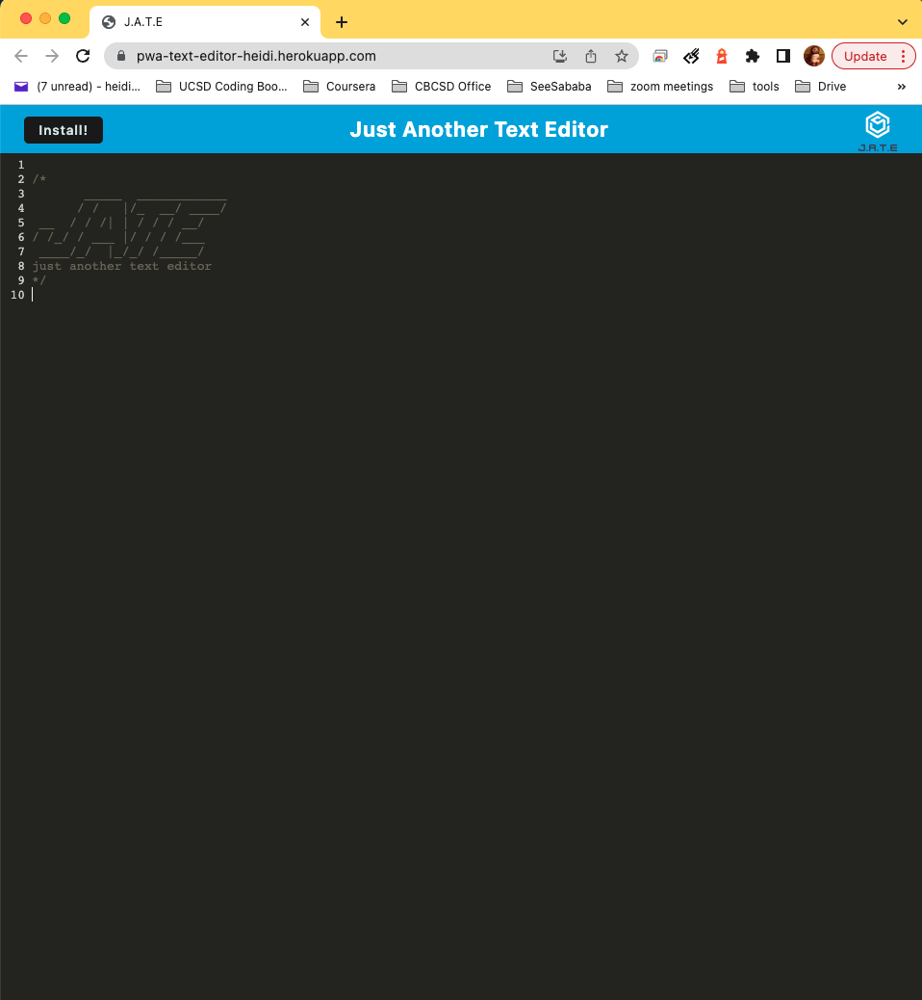

# PWA-Text-Editor

## Description
This is a text editor that runs in the brower, it is also a single-page application that meets the PWA criteria. It features a number of data persistence techniques that serve as redundancy in case one of the options is not supported by the browser. The application will also function offline.

## Table of Contents
* [Deployed Application](#deployed-application)
* [Usage](#usage)
* [Built With](#built-with)
* [Screenshot](#screenshot)
* [License](#license) 

## Deployed Application

Here is the link [https://pwa-text-editor-heidi.herokuapp.com/](https://pwa-text-editor-heidi.herokuapp.com/) for the deployed application.

## Usage
- When you visit the website, you will see the editor initially loaded with a header. Feel free to input content in the editor.
- When you click off of the editor window and then come back, the content persists. It is achieved by storing the data in indexedDB.
- when you close the editor and then reopen it, the content persist. It is also achieved by storing the data in indexedDB.
- When you click on the Install button, the application is downloaded as an icon on your desktop.
- The application is still functioning offline, as service working is registered to cache static assets.

## Built With

- Front-End:
    - *HTML*
    - *CSS*
    - *JavaScript*
    - *webpack*
    - *workbox*
    - *babel*
    - *workpack-pwa-manifest*
- Back-End:
    - *Node.js*
    - *Express.js*
- Deployment
    - *Heroku*
    

## Screenshot

Inital loading in browser:

With Content:

Intall Prompt (appear after the Install button is clicked):

Installed Application:

App Icon in Lauchpad:

## License

 

This project is licensed under the terms of the MIT license.